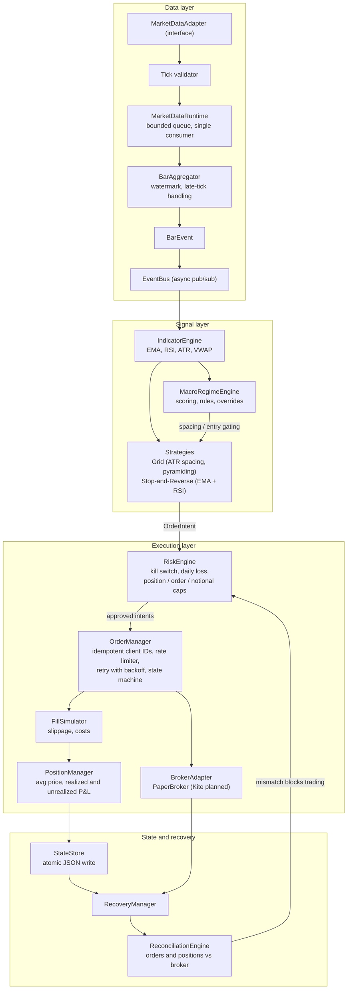

## Architecture

Event-driven, layered design. Strategies only emit `OrderIntent`s. Nothing reaches a broker without passing risk checks and the idempotent order manager.

### Layer responsibilities

| Layer | Modules | Responsibility |
|---|---|---|
| Core | `core/models`, `core/events` | Immutable domain models, async event bus |
| Data | `data/` | Validation, bounded-queue runtime with back-pressure, tick-to-bar aggregation |
| Indicators | `indicators/` | One implementation per indicator, `Decimal` math |
| Regime | `regime/` | Proxies, scoring, classification, parameter overrides |
| Strategies | `strategies/` | Pure functions of context returning `OrderIntent`s |
| Risk | `risk/` | Kill switch, loss limit, position and notional caps |
| Execution | `execution/` | Idempotency, state machine, rate limiting, retry, fills, positions, P&L |
| Recovery | `execution/recovery.py` etc. | Persist state, reconcile with broker on restart |

### Design decisions
- **`Decimal` end to end**, never floats for prices or P&L.
- **Single-writer aggregation**: one consumer owns bar state, which avoids races by construction.
- **Deterministic client order IDs** for idempotent submission.
- **Strategies never touch brokers**: risk and execution gate everything.
- **Reconciliation gates trading** after restart.

## Status

| Area | Status |
|---|---|
| Core models, event bus | Done |
| Tick validation, aggregation, async runtime | Done |
| Indicators (EMA, RSI, ATR, VWAP) | Done (reference-value tests in progress) |
| Grid and stop-reverse signal generation | Done (grid exit logic planned) |
| Risk engine | Done |
| Order manager, state machine, rate limiter | Done |
| Reconciliation, recovery, state store | Done (order persistence planned) |
| Regime engine | Partial (proxy ingestion and circuit breakers planned) |
| Backtest harness | Planned (cost and fill models exist) |
| Kite Connect REST/WebSocket, contract masters, expiry/rollover | Planned |
| Observability (structured logs, blotter, phone alerts) | Planned |
| SDLC agents and CI | Planned |

## Known limitations
- No live broker integration yet. Execution runs against `PaperBroker`.
- Cost model is simplified. Indian STT/CTT, brokerage caps, GST and tick-size rounding are not yet modelled.
- No end-to-end orchestrator wiring `BarEvent` to strategies. Components are individually tested.
